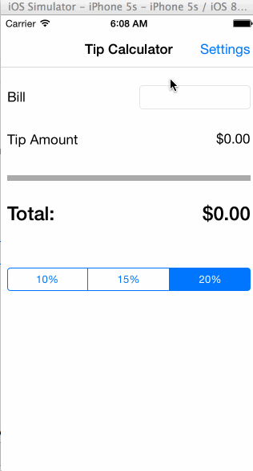

# Tip Calculator

This is the Tip Calculator project for my CodePath iOS Bootcamp application.

Time spent: 1.5 hours

Required stories:
- [x] User can input numeric bill amount
- [x] Tip amount and total are calculated and shown on screen
- [x] User can set default tip percentage on settings page
- [x] Default tip percentage is saved across application loads

Optional stories:
- [x] Tip amount and total are updated after every input change made to the bill amount
- [x] Tip amount and total are shown with commas as thousands separators

Walkthrough:

